# Sentinel: RAG-Based Customer Insight Engine

> An end-to-end pipeline that ingests customer conversation logs, stores them in a hybrid SQL + vector database, and exposes a context-aware Q&A bot powered by Retrieval-Augmented Generation (RAG).

---

## System Flow

```mermaid
flowchart TD
    A([📂 Raw Logs\n.jsonl / .csv]) --> B

    subgraph INGEST ["⚙️ INGESTION LAYER — data_ingestion.py"]
        B[Parse & Validate\nPydantic schema] --> C{Valid?}
        C -- No --> DLQ([🗑️ Dead-Letter Queue])
        C -- Yes --> D[NLP Pre-processing\nHTML strip · PII redact · Boilerplate remove · Unicode normalise]
    end

    D --> E & F

    subgraph STORE ["🗄️ STORAGE LAYER — Hybrid ELT / ETL"]
        E[(PostgreSQL 15\nMetadata · Agents · CSAT · Topics\nIndexed · Materialized Views)]
        F[Embedding Model\nOpenAI ada-002 · HuggingFace fallback\nBatch 512 · SHA-256 cache] --> G[(FAISS / ChromaDB\nDense Vectors · ANN Index)]
    end

    H([💬 User Query]) --> I & J

    subgraph RAG ["🧠 RAG LOGIC LAYER — LangChain"]
        I[Coarse Retrieval\nANN search · Top-20 candidates] --> K[Cross-Encoder Re-rank\nms-marco-MiniLM · Top-5 selected]
        J[SQL Enrichment\nDate · Channel · Topic filters] --> L
        K --> L[Prompt Builder\nContext injection · Token budget]
        L --> M[LLM — GPT-4o\nTemp 0.0 · Grounded generation]
    end

    G --> I
    E --> J
    M --> N([✅ Cited Answer\nor: Insufficient Evidence])

    style INGEST fill:#1e1b4b,stroke:#818cf8,color:#c7d2fe
    style STORE  fill:#064e3b,stroke:#10b981,color:#a7f3d0
    style RAG    fill:#4a044e,stroke:#e879f9,color:#f5d0fe
```



---

## Architecture at a Glance

| Layer | What it does | Key files |
|---|---|---|
| **Ingestion** | Reads logs, validates schema, cleans text | `src/data_ingestion.py`, `src/preprocessing_pipeline.py` |
| **Storage** | Persists metadata to PostgreSQL; embeds & indexes text to FAISS | `src/vector_embedding_manager.py`, `sql/schema.sql` |
| **RAG Logic** | Retrieves top chunks, enriches with SQL, generates grounded answer | `src/rag_chain.py` |

---

## Why Hybrid Storage?

- **ELT → PostgreSQL**: Raw metadata (IDs, timestamps, CSAT) is loaded first, transformed later via SQL. Business logic stays flexible.
- **ETL → FAISS**: Text must be cleaned *before* embedding — noisy vectors require full re-indexing to fix. Pre-embedding cleanup is the only cost-effective approach.

---

## Key Design Decisions

**Two-stage retrieval** — ANN search (top-20) → cross-encoder re-rank (top-5) — improves precision over naive top-k without sacrificing recall.

**SHA-256 embedding cache** — re-ingesting unchanged records skips redundant API calls and saves cost at scale.

**Grounded prompting** — the LLM is instructed to answer *only* from retrieved context. If evidence is insufficient, it returns a structured refusal instead of hallucinating.

**Dead-letter queue** — records failing validation are logged for manual review, never silently dropped.

---

## Tech Stack

`Python 3.11` · `PostgreSQL 15` · `FAISS / ChromaDB` · `LangChain 0.2` · `OpenAI GPT-4o` · `Docker Compose` · `Pydantic v2`

---

## Quick Start

```bash
# 1. Configure environment
cp .env.example .env   # add OPENAI_API_KEY and POSTGRES_PASSWORD

# 2. Start services
docker-compose up --build

# 3. Run ingestion
python src/data_ingestion.py --source data/sample_logs/ --batch-size 512

# 4. Query the bot
python src/rag_chain.py --interactive
```

---

## Repository Structure

```
sentinel/
├── src/
│   ├── data_ingestion.py          # Batch ingestion pipeline
│   ├── preprocessing_pipeline.py  # NLP cleaning (HTML · PII · boilerplate)
│   ├── vector_embedding_manager.py# Embedding + FAISS indexing
│   ├── rag_chain.py               # LangChain RAG chain
│   ├── db_client.py               # PostgreSQL query layer
│   └── config.py                  # Environment-driven config
├── sql/
│   ├── schema.sql                 # Schema with indexes + materialized views
│   └── queries/                   # Analytical SQL examples
├── notebooks/                     # EDA + embedding quality analysis
├── docker-compose.yml
├── Dockerfile
└── requirements.txt
```

---

## Challenges & Solutions

| Challenge | Solution |
|---|---|
| Noisy CRM exports (HTML, boilerplate, PII) | Sequential NLP pipeline before embedding; failures go to dead-letter queue |
| Embedding cost at scale | Batch API calls (512/batch) + SHA-256 hash cache; HuggingFace offline fallback |
| LLM context window overflow | Sentence-boundary chunking + tiktoken budget; trim lowest-ranked chunks first |

---

## License

MIT — see `LICENSE`.
